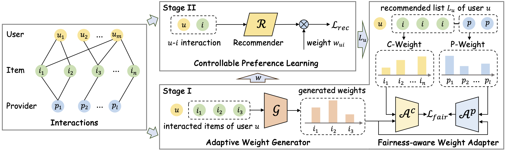

# [RecSys 2024 short] Promoting Two-sided Fairness with Adaptive Weights for Providers and Customers in Recommendation

**Ada2Fair** aims to promote two-sided fairness with adaptive weights for providers and customers in recommendation.

> Lanling Xu, Zihan Lin, Jinpeng Wang, Sheng Chen, Wayne Xin Zhao and Ji-Rong Wen. Promoting Two-sided Fairness with Adaptive Weights for Providers and Customers in Recommendation. RecSys 2024 Short Paper.



Ada2Fair involves two stages: how to generate weights in stage I and and how to utilize weights in stage II. The former generates weights as a prerequisite for the latter, while the latter utilizes weights as our core objective.

To learn two-sided fairness-aware weights during model training in a general way, we propose an adaptive weight generator to produce fairness-aware weights, and devise the strategies for two-sided fairness-aware weighting based on dynamic recommendation results. Then, a fairness-aware weight adapter is futher utilized to guide the learning of the weight generator.

## 📚 Dataset Description

As summarized in the following table, we select three public datasets, i.e., **Book-Crossing**, **Amazon Video Games** and **BeerAdvocate** to conduct experiments considering typical domains (books, games and beverages) and different scales (from thousands to millions). 

| Datasets | #Users  | #Items  | #Interactions | # Providers |
| -------  | ------- | ------- | ------------- | ----------- |
| 📖 Book-Crossing      |    6,400  | 8,496   | 106,918    | 607   |
| 🎮 Amazon_Video_Games |   44,189  | 14,752  | 394,832    | 1,621 |
| 🍺 BeerAdvocate       |   14,041  | 20,562  | 1,361,000  | 2,694 |

To evaluate the two-sided fairness, **publishers in book domain**, **companies in game domain** and **brewers in beer domain** are extracted from attribute information as the provider of items, which is consistent with the actual application scenario. 

## ✨ Quick Start

1. Unzip dataset files.
    ```bash
    cd dataset/Book-Crossing/; unzip Book-Crossing.zip
    cd dataset/Amazon_Video_Games/; unzip Amazon_Video_Games.zip
    cd dataset/BeerAdvocate/; unzip BeerAdvocate.zip
    ```
2. Install dependencies.
    ```bash
    pip install -r requirements.txt
    ```
3. Evaluate the performance of BPRMF model with and without our approach on Book-Crossing dataset.
    ```bash
    # without Ada2Fair (the typical accuracy-focused method)
    python run_model.py --model=BPR --dataset=Book-Crossing
    ```
    
    ```bash
    # with Ada2Fair (the two-sided fairness-aware method)
    python run_model.py --model=BPR --dataset=Book-Crossing --fairness_type=ada2fair
    ```

## 🧐 Parameter Configurations

### Configuration files

Parameter configurations consist of three parts/files: 
- overall configuration ([[overall.yaml]](props/overall.yaml))
- dataset configuration (e.g., [[Book-Crossing.yaml]](props/Book-Crossing.yaml))
- model configuration (e.g., [[BPR.yaml]](props/BPR.yaml))

### General configurations

To ensure a fair comparison, we optimize all the models with _Adam optimizer_ and parameters are initialized by the default _Xavier distribution_. 

The training batch size is set to 4,096 and the embedding size is set to 64. We stop training when the performance on the validation set does not improve for 20 epochs, and NDCG@20 is set as the indicator. 

### Hyper-parameter tuning

The hyper-parameter tuning range of each model is located in the `hyper-range` folder. 

The example code for hyper-parameter tuning is as follows:

```bash
# For BPRMF model on the Book-Crossing dataset
python run_hyper.py --model=BPR --dataset=Book-Crossing --params_file=hyper-range/bpr.test --output_file=hyper_Book-Crossing_BPR.result
```

As for general parameters of all methods, we tune the learning rate in [1e-4,5e-4,1e-3,5e-3,1e-2] and the number of graph convolutional layers in [1,2,3]. 

For Ada2Fair, the hidden size $d_1$ of $\mathcal{G}$ is set to 32 and the hidden dimension $d_2, d_3$ of $\mathcal{A}$ are fixed to 16. As for the training steps of two phases, $s_1$ is set to 10 and $s_2$ equals 1. In addition, we tune the $\alpha$ parameter ranging in [0, 1] to strike a balance between the two-sided fairness. For baselines, we carefully search the hyper-parameters following the settings of original authors. The implementation will be released after the anonymous stage.

## 🌟 Acknowledgement

Please cite the following paper if you find our code helpful.

```bibtex
@inproceedings{xu2024ada2fair,
  author    = {Lanling Xu and Zihan Lin and Jinpeng Wang and Sheng Chen and Wayne Xin Zhao and Ji-Rong Wen},
  title     = {Promoting Two-sided Fairness with Adaptive Weights for Providers and Customers in Recommendation},
  booktitle = {{RecSys}},
  publisher = {{ACM}},
  year      = {2024}
}
```

- The experiments are conducted using the open-source recommendation library [RecBole](https://github.com/RUCAIBox/RecBole).
- Thanks for your reading and guidance. If you have any questions, please feel free to give me your advice.
